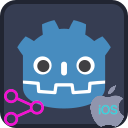

	
	&nbsp;&nbsp;&nbsp;&nbsp;&nbsp;&nbsp;
	

---

#  Godot Share Plugin

Share Plugin allows sharing of text and images on Android and iOS platforms.

**Features:**
- Share with other apps on Android and iOS
- Allows sharing of
  - Text
  - Images
  - Other files

---

##  Table of Contents
- [Installation](#installation)
- [Usage](#usage)
- [Signals](#signals)
- [Platform-Specific Notes](#platform-specific-notes)
- [Links](#links)
- [All Plugins](#all-plugins)
- [Credits](#credits)
- [Contributing](#contributing)

---

##  Installation

**Uninstall previous versions** before installing.
If using both Android & iOS, ensure **same addon interface version**.

**Options:**
1. **AssetLib**
	- Search for `In-app Review`
	- Click `Download` → `Install`
	- Install to project root, `Ignore asset root` checked
	- Enable via **Project → Project Settings → Plugins**
	- For iOS, also enable via the export settings
	- Ignore file conflict warnings for GDScript interface files when installing both versions
2. **Manual**
	- Download release from GitHub
	- Unzip to project root
	- Enable via **Project → Project Settings → Plugins**
	- For iOS, also enable via the export settings

---

##  Usage
Add a `Share` node to your scene and follow the following steps:
- use one of the following methods of the `Share` node to share text or images:
		- `share_text(title, subject, content)`
		- `share_image(full_path_for_saved_image_file, title, subject, content)`
				- Note that the image you want to share must be saved under the `user://` virtual directory in order to be accessible. The `OS.get_user_data_dir()` method can be used to get the absolute path for the `user://` directory. See the implementation of `share_viewport()` method for sample code.
		- `share_viewport(viewport, title, subject, content)`

---

##  Signals

- `share_completed`: Emitted when shared item is sent on iOS. On Android, emitted when a share target is selected on the chooser screen.
- `share_canceled`: Emitted when user does not send shared item on iOS. On Android, emitted when user returns to app without making a selection on chooser screen within threshold milliseconds (default threshold is 5000ms).
- `share_failed`: Emitted when a failure that prevents sharing occurs.

*Note: On Android, `share_completed` signal does not mean that the user actually sent the shared item.*

---

##  Platform-Specific Notes

### Android
- **Package name** In your project's Android export settings, remove/replace the `$genname` token from the `package/unique_name`
- **Build:** [Create custom Android gradle build](https://docs.godotengine.org/en/stable/tutorials/export/android_gradle_build.html).
- **Registration:** App must be registered with the Google Play.
- **Troubleshooting:**
  - Logs: `adb logcat | grep 'godot'` (Linux), `adb.exe logcat | select-string "godot"` (Windows)
  - Also check out: https://docs.godotengine.org/en/stable/tutorials/platform/android/android_plugin.html#troubleshooting

### iOS
- **Troubleshooting:**
	- View XCode logs while running the game for troubleshooting.
	- See [Godot iOS Export Troubleshooting](https://docs.godotengine.org/en/stable/tutorials/export/exporting_for_ios.html#troubleshooting).
	- **Export settings:** Plugin must be enabled also in the export settings.

---

#  Links

- [AssetLib Entry Android](https://godotengine.org/asset-library/asset/2542)
- [AssetLib Entry iOS](https://godotengine.org/asset-library/asset/2907)

---

#  All Plugins

| Plugin | Android | iOS | Free | Open Source | License |
| :--- | :---: | :---: | :---: | :---: | :---: |
| [Notification Scheduler](https://github.com/godot-sdk-integrations/godot-notification-scheduler) | ✅ | ✅ | ✅ | ✅ | MIT |
| [Admob](https://github.com/godot-sdk-integrations/godot-admob) | ✅ | ✅ | ✅ | ✅ | MIT |
| [Deeplink](https://github.com/godot-sdk-integrations/godot-deeplink) | ✅ | ✅ | ✅ | ✅ | MIT |
| [Share](https://github.com/godot-sdk-integrations/godot-share) | ✅ | ✅ | ✅ | ✅ | MIT |
| [In-App Review](https://github.com/godot-sdk-integrations/godot-inapp-review) | ✅ | ✅ | ✅ | ✅ | MIT |

---

#  Credits

Developed by [Cengiz](https://github.com/cengiz-pz)

Android part is based on [Shin-NiL](https://github.com/Shin-NiL)'s [Godot Share plugin](https://github.com/Shin-NiL/Godot-Android-Share-Plugin)

iOS part is based on on: [Godot iOS Plugin Template](https://github.com/cengiz-pz/godot-ios-plugin-template)

Original repository: [Godot Share Plugin](https://github.com/godot-sdk-integrations/godot-share)

---

#  Contributing

This section provides information on how to build the plugin for contributors.

---

##  Common Configuration

The `common/config.properties` file allows for the configuration of:

- The name of the main plugin node in Godot
- Plugin version
- Version of Godot that the plugin depends on
- Release type of the Godot version to download (ie. stable, dev6, or beta3)

---

##  iOS

### Prerequisites

- [Install SCons](https://scons.org/doc/production/HTML/scons-user/ch01s02.html)
- [Install CocoaPods](https://guides.cocoapods.org/using/getting-started.html)

---

### iOS Configuration

Among other settings, the `ios/config/config.properties` file allows for the configuration of:

- The target iOS platform version
- Valid/compatible Godot versions

---

### Build

#### Build All and Create Release Archives for Both Platforms

- Run `./script/build.sh -R` -- creates all 3 archives in the `./release` directory

#### iOS Builds
iOS build script can be run directly as shown in the examples below.

- Run `./ios/script/build.sh -A` initially to run a full build
- Run `./ios/script/build.sh -cgA` to clean, redownload Godot, and rebuild
- Run `./ios/script/build.sh -ca` to clean and build without redownloading Godot
- Run `./ios/script/build.sh -cbz` to clean and build plugin without redownloading Godot and package in a zip archive
- Run `./ios/script/build.sh -h` for more information on the build script

Alternatively, iOS build script can be run through the root-level build script as follows

- Run `./script/build.sh -i -- -cbz` to clean and build plugin without redownloading Godot and package in a zip archive
- Run `./script/build.sh -i -- -h` for more information on the build script

___

##  Install Script

- Run `./ios/script/install.sh -t <target directory> -z <path to zip file>` install plugin to a Godot project.
- Example `./ios/script/install.sh -t demo -z build/release/ThisPlugin-v4.0.zip` to install to demo app.

___

##  Libraries

Library archives will be created in the `build/release` directory.

---

##  Android

---

### Android Configuration

The `android/gradle/lib.versions.toml` contains:

- Gradle plugins and their versions
- Library dependencies and their versions

### Build

**Options:**
1. Use [Android Studio](https://developer.android.com/studio) to build via **Build->Assemble Project** menu
	- Switch **Active Build Variant** to **release** and repeat
	- Run **packageDistribution** task to create release archive
2. Use project-root-level **build.sh** script
	- `./script/build.sh -ca` - clean existing build, do a debug build for Android
	- `./script/build.sh -carz` - clean existing build, do a release build for Android, and create release archive in the `android/<plugin-name>/build/dist` directory
